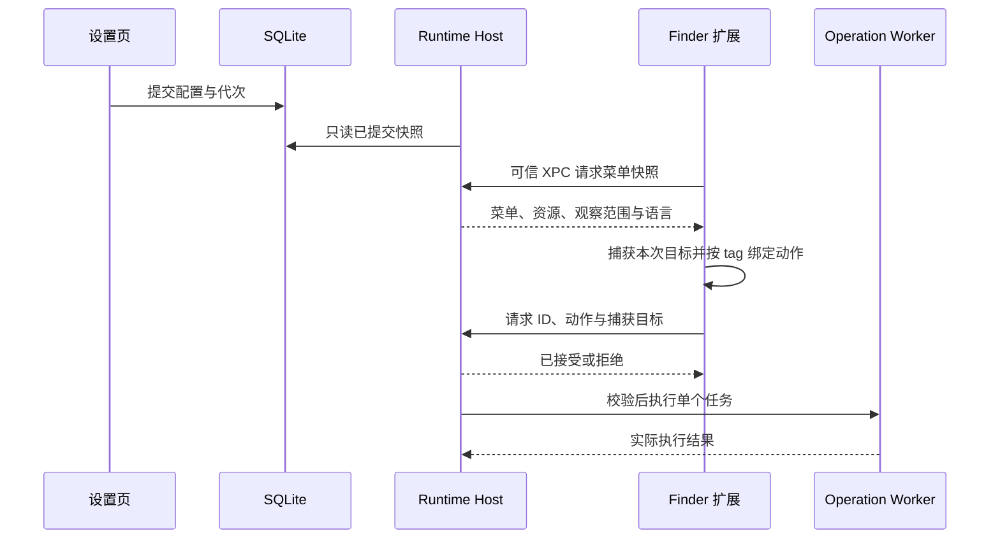

# 架构与数据流

本文以当前源码为准，最后核对于 2026-09-30。当前安装包与后续源码的差异见[交付](交付.md)，尚未实现或验收的事项见[规划](规划.md)。

## 目录与编译边界

`Sources` 分为 `Application`、`Features`、`Platform`、`UI`。功能代码聚合与编译隔离分别维护，完整声明见 [Package.swift](../Package.swift) 和 [Build/Xcode/Modules.yml](../Build/Xcode/Modules.yml)。

| 目录 | SwiftPM 模块 | 职责与直接依赖 |
| --- | --- | --- |
| Platform，排除 Persistence | ArcKitPlatform | 路径、日志、进程、权限、XPC、坐标、图标、本地化；Apple SDK |
| Platform/Persistence | ArcKitPersistence | SQLite 连接、事务、记录映射、资源入库；Platform、GRDB |
| Application、UI、Features 的前端部分 | ArcKitApplication | 功能界面与客户端、配置写入、生命周期、应用编排；Persistence、Platform、Finder、Window、Mouse |
| Features/Finder/Domain | ArcKitFinder | 菜单与文件模型、动作规则、快照、协议、模板；Platform |
| Features/Finder/Runtime | ArcKitFinderRuntime | 命令接收与准入、Worker、执行与回滚；Platform、Finder |
| Features/Finder/Extension | ArcKitFinderSync | 系统回调、菜单渲染、目标捕获与可信通信；Platform、Finder |
| Features/Window/Domain | ArcKitWindow | 配置、布局计算与通信契约；Platform |
| Features/Window/Runtime | ArcKitWindowRuntime | AX 控制、快捷键、拖拽和服务端；Platform、Window |
| Features/Mouse/Domain | ArcKitMouse | 配置、滚动及手势算法与通信契约；Platform |
| Features/Mouse/Runtime | ArcKitMouseRuntime | 输入监听、输出调度和服务端；Platform、Mouse |

仍为 10 个库 target。主 App 与 Host 的入口位于 `Targets/`；Xcode 将 Finder Extension 直接编译成 `.appex`，SwiftPM 的 ArcKitFinderSync 用于同源编译与测试。本地化插件是构建工具，不是运行组件。

Platform 不依赖业务，Finder/Window/Mouse 领域库互不依赖。Application target 显式排除领域、Runtime、Extension 和 Platform 的源码；只通过声明的库依赖访问领域能力。主 App 不链接后台实现，Finder 扩展不链接 GRDB。

功能按自身规模组织：Finder、窗口、鼠标拥有 Domain、Settings、Client、Runtime；壁纸按图库、图源、媒体和桌面分组，外观单独拥有背景与主题。完整目录见[目录结构](目录结构.md)。

### 应用装配与功能接入

[ApplicationWorkspace](../Sources/Application/Composition/ApplicationWorkspace.swift) 组装页面、功能配置和运行状态。MainWindowController 只负责窗口生命周期和内容工厂，MainWindowView 只负责侧栏、工具栏及内容呈现；它们不再逐层转交所有功能服务。

各功能声明标题、图标和搜索命令；[ApplicationFeatureCatalog](../Sources/Application/Navigation/ApplicationFeatureCatalog.swift) 决定导航顺序，搜索算法统一匹配和排序。没有动态插件扫描或注册反射。动作按运行诊断、通用设置、数据管理、窗口命令分别注入，普通页面不持有完整应用动作集合。

壁纸以素材 URL、类型和异步动作交付外观，[WallpaperBackgroundIntegration](../Sources/Application/Composition/WallpaperBackgroundIntegration.swift) 连接两端。外观在执行时检查加载/忙碌状态，保存完成才返回成功，失败沿壁纸操作回执返回；两个功能不直接持有对方模型。鼠标规则页只接收可添加应用的候选信息，不依赖窗口服务。

## 进程与生命周期

| 组件 | 运行规则 |
| --- | --- |
| 主应用 | 唯一配置写入者、设置与菜单栏、注册决策和诊断 |
| Runtime Host | 同一个后台装配 Finder、Window、Mouse Runtime |
| Operation Worker | Host 可执行文件的 `--operation-worker` 模式，一次一个，完成后退出 |
| Finder 扩展 | 系统托管，可有多个合法实例，不直接执行文件副作用或访问数据库 |

[RuntimeHostCoordinator](../Sources/Application/Runtime/RuntimeHostCoordinator.swift) 由 ApplicationRuntime 显式持有，是唯一注册与恢复决策入口。[RuntimeHostSystem](../Sources/Application/Runtime/RuntimeHostSystem.swift) 负责 SMAppService、会话文件和作业查询；[RuntimeHostTransport](../Sources/Application/Runtime/RuntimeHostTransport.swift) 负责控制连接。

安装包只包含一个 Host 和一个 LaunchAgent plist，没有 RunAtLoad/KeepAlive。control、finder、window、mouse 四个 Mach endpoint 由同一个进程监听，不是四个 server。

- 窗口或鼠标开启时保留 Host，只启用需要的监听与帧驱动。
- 仅 Finder 开启时，无请求、菜单构建及文件任务后空闲约 15 秒退出，后续按需唤醒。
- 功能全关注销 Host 并移除会话。正常退出等待保存、停止和注销确认；失败时取消退出并恢复运行。
- 会话校验主 App PID、启动时间、UUID 和配置代次，防止 PID 复用和旧回包复活。
- 断线有界退避重连，最多 3 次，稳定 30 秒恢复预算；普通检测和授权轮询不重建会话。
- Host 和 Worker 各有进程锁。Worker 回收任务进程组，覆盖父进程退出、终止与 120 秒截止；用户另开的独立应用不属于该组。

统一 Host 减少重复生命周期，但 Window/Mouse 原生崩溃仍影响同一进程。Worker 是文件任务故障边界，不是恶意脚本沙箱；主动脱离进程组的脚本不在清理保证内。

登录启动由 Lifecycle 中的 LaunchAtLoginCoordinator 消费已提交意图，LaunchAtLoginService 持有系统状态与注册回执。等待用户许可保留开启意图，不重复注册；失败回滚仍经 SettingsModel 提交。隐藏文件和截图目录的实现归 Features/SystemTools，由通用设置页使用，不参与登录项管理。

## 数据目录与事务

[ArcKitStoragePaths](../Sources/Platform/ArcKitStoragePaths.swift) 是路径唯一来源。Release 使用 `~/.arc-kit/`，Debug 使用仓库 `.build/ui-debug/data/`。

```text
.arc-kit/
  app.sqlite          配置、素材索引、配置代次
  assets/media/       按内容哈希存储的图片、视频和封面
  assets/templates/   托管模板
  logs/               分组件滚动日志
  runtime/            会话、进程锁、回执和运行摘要
  cache/              thumbnails、remote、updates
  tmp/                带所有者记录的任务临时目录
  backups/            设置恢复点、内部快照及升级回退资料
  diagnostics/        诊断副本与恢复前数据库
```

数据根必须是当前用户拥有的本地目录，拒绝云盘、网络卷和符号链接重定向；受管目录使用 0700，受管普通文件使用 0600。Finder 扩展不绕过沙盒读取数据根。

[ArcKitDatabase](../Sources/Platform/Persistence/ArcKitDatabase.swift) 使用 GRDB 7.11.1 与系统 SQLite。主应用持有单写连接与进程锁，Host 只读连接，不创建或迁移数据库。启用外键，写入使用 DELETE journal 和 FULL synchronous。损坏、未来格式或不合法业务字段明确失败，不创建默认空库冒充恢复成功。

[ApplicationStorage](../Sources/Application/Storage/ApplicationStorage.swift) 注入写连接的准备流程与 [ApplicationStorageMigrations](../Sources/Application/Storage/ApplicationStorageMigrations.swift)。业务表、唯一索引、素材引用外键及 Finder/语言修复归应用存储层；Persistence 仅提供连接、事务、通用元数据和记录建表能力。只读连接使用独立构造入口，不接收迁移。数据库按顺序维护七项迁移：`storage-v1`、`finder-menu-selection-v1`、`application-language-v1`、`background-aura-v1`、`menu-bar-visibility-v1`、`mouse-uu-remote-rule-v1`、`mouse-rule-note-v1`，已使用的迁移名称与顺序不得重写。壁纸库、图源和背景 store 显式接收该数据库；测试显式注入临时库，功能内部没有生产路径默认值或应用工厂调用。

设置、资源索引及相关 revision 在事务内提交。Host 在一个只读事务中读取 Finder、窗口、鼠标及运行代次，避免跨域混读。资源内容经暂存、校验及发布后进入索引；素材解除引用后保守保留，不假设当前屏幕能够枚举所有 Space 或备份引用。

JSON 不承担日常配置持久化。当前 AppSettings schema 为 23、Finder 快照为 11；SQLite `user_version=1` 与 GRDB 命名迁移分别管理数据库格式。设置备份格式版本与这些版本也是独立概念，不能互相替代。

## 配置提交与数据操作

Finder、窗口、鼠标页面通过 `SettingsEditor<本功能配置>` 编辑同一份草稿，不能读取或改动其他配置域。编辑器不持久化、不复制草稿，撤销重做、合并连续操作及排他门禁仍由 SettingsModel 管理。设置编辑进入 [SettingsModel](../Sources/Application/Settings/SettingsModel.swift)，持久化成功并回读后才推进已提交设置。[RuntimeSettingsSession](../Sources/Application/Runtime/RuntimeSettingsSession.swift) 将提交事件送入运行组合根；失败草稿不传播给 Host。主题、Dock 等界面偏好不重连输入服务；影响运行快照的配置按代次生效。

页面只持有编辑状态，不能自行注册服务或发布第二份运行配置。WindowRuntimeClient、MouseRuntimeClient 由协调器显式传入会话和代次，停用会取消排队请求，迟到回包失效。已经发出的副作用不因此获得回滚保证。

RuntimeHostCoordinator 以数据库已提交的 `runtime_revision` 为唯一配置失效依据，不另建字段白名单。语言变化同样推进后台代次；Dock、外观和规则说明不推进。协调器与控制、窗口、鼠标客户端同步采用新代次，Host 仍拒绝旧代次命令；Host 内只在对应功能配置变化时重建监听。

[DataTransferCoordinator](../Sources/Application/Storage/DataTransferCoordinator.swift) 统一选择备份范围、文件和恢复确认；[DataManagementModel](../Sources/Application/Storage/DataManagementModel.swift) 持有任务、进度、恢复点及结果；[StorageMaintenance](../Sources/Application/Storage/StorageMaintenance.swift) 执行磁盘操作。AppController 和调试会话分别持有数据模型并注入页面，任务状态不依附 View 生命周期。

SettingsModel 只管理设置草稿、提交及撤销重做。其 [SettingsOperationGate](../Sources/Application/Settings/SettingsOperationGate.swift) 是编辑、历史、备份恢复、卸载和退出共用的排他门禁；任务持有租约，失败路径也释放，旧回调不能释放新任务的租约。持有者可等待保存或在完整恢复后重载；其他操作不能绕过正在运行的数据任务。配置始终只有一份，备份模型不复制运行配置。

全量包包含数据库、模板、素材及哈希清单；设置 JSON 仅包含通用与三个功能配置及托管模板。完整恢复等待待保存内容、停止运行会话、校验包和引用、保留旧数据库再替换，然后重载模型并恢复服务。导入设置或恢复默认前保存设置恢复点，两者不能混称完整备份。备份、恢复、重置、缓存任务、历史操作和卸载按门禁避免冲突。

诊断导出由 [SupportDiagnosticsCoordinator](../Sources/Application/Diagnostics/SupportDiagnosticsCoordinator.swift) 采集摘要及近期脱敏日志，不复制数据库、素材或完整设置。数据管理只有一处导出入口。

## Finder 菜单与执行



接收回执不等于执行成功。扩展只保留可信快照的内存缓存，通知只触发刷新，不携带配置；缺失或失效时不回退默认菜单。菜单请求期间不扫描磁盘、不阻塞等待 XPC、不查询惰性系统图标。

每次菜单生成时冻结上下文，用唯一 tag 关联动作与目标；不能依赖 Finder 可能改写的 identifier，也不能在点击时重新猜选区。Host 在交互前与实际派发前检查最新模块、条目及高风险准入，Worker 再检查传入配置。移除或停用条目后拒绝旧请求，已经开始的操作不自动回滚。

[FinderCommandDispatcher](../Sources/Features/Finder/Runtime/Commands/FinderCommandDispatcher.swift) 对 payload 穷尽分发，具体执行器负责文件计划、排他发布与失败恢复。固定工具使用 argv；脚本入口才处理用户脚本。应用打开等待 NSWorkspace 完成回执，超时不重放。

XPC 校验双方进程身份，并限制载荷、连接、在途请求和时效。Host 保留有界请求接收记录，重启后拒绝同会话重放；超时后的副作用仍可能结果未知。文件回滚目前是任务内能力，不是崩溃恢复日志。

### 菜单设计依据

- [Apple HIG · Context menus](https://developer.apple.com/design/human-interface-guidelines/context-menus) 与 [Menus](https://developer.apple.com/design/human-interface-guidelines/menus)：动作与对象相关，精简分组，避免多层子菜单，需要继续输入的动作带省略号。
- [Finder Sync Extension Guide](https://developer.apple.com/library/archive/documentation/General/Conceptual/ExtensibilityPG/Finder.html)：回调、观察范围及目标有效期受系统约束，扩展可有多个实例。
- [OpenInTerminal](https://github.com/Ji4n1ng/OpenInTerminal)：参考公开 FinderSync 入口和软件图标呈现；不采用按标题路由、全盘观察或缺目标猜前台窗口。

继续使用薄 Finder Sync 接入，不注入 Finder、不增加云盘接管服务。默认观察 Home 和独立 iCloud 根，只有该根豁免 Library 限制。观察注册不保证回调；工具栏同样可能没有目标。真实云盘限制保留在使用文档与待办中。

功能项使用彩色 Lucide；应用、终端和模板优先使用软件自身图标。Host 预加载为可传输位图，菜单和预览共用来源；打开的菜单不异步改写，缺图时使用通用图标，下次打开更新。新建文件、常用应用、常用目录的 enabled 统一属于菜单模块，详情页不再提供重复开关。

## 窗口与鼠标

WindowTargetSession 管理主应用捕获状态；Host 持有实际窗口目标令牌。菜单栏以原生 NSMenu 承载，主 App 观察 `NSWorkspace.frontmostApplication` 的 KVO 变化，维护实际键盘接收应用的有界时间线；不能把 `didActivateApplicationNotification` 的通知对象当成前台应用，菜单代理的激活通知可能指向 Arc Kit 自身。输入线程按原始按下时间固定来源，不在回调里查询 AppKit 前台状态。重复或迟到转发不能覆盖来源；菜单打开时还须与实际前台一致，不一致便拒绝捕获；打开后也由同一前台观察关闭失效菜单。时间线记录 Arc Kit 自身与未知状态，不能回退到最近的外部应用。拿不到来源或窗口时禁用布局，在原布局区域显示失败原因。执行使用同一窗口令牌，不按迟到的前台状态改选目标。页面校验失败不改写后台健康。

窗口布局基于屏幕可用区域和统一坐标转换，支持负坐标副屏、间距、应用规则和最小尺寸校验。台前调度只是右侧 85% 的布局策略，不控制系统台前调度设置。

鼠标输入从 `cgAnnotatedSessionEventTap` 获取带窗口标注的事件，再按目标 PID 投递。目标窗口标注是历史 USB 修复的关键，不能只通过合成事件或隐藏 NSScrollView 消费回归判断真实路由成功。

滚动参数由同一个 effectiveTuning 入口解析全局、应用规则与作用范围。原生触控手势按 phase 放行，普通和高分辨率滚轮分别计算距离。输入、平滑帧生成、输出投递与取消分层；输出计数仅证明提交，不能证明目标应用已消费。帧刷新器创建或启动失败可有界重建，成功输出后清理该组件的旧降级状态。

UU 远程默认使用一条普通的“不启用增强”（`system`）应用规则，原样放行送往远程客户端的输入，避免控制端和被控端重复增强。默认配置属于 Mouse，旧安装的一次性补充归 ApplicationStorageMigrations；Runtime 仍只读取已提交规则，不维护隐藏的应用黑名单，也不在启动时补回用户删除的规则。

## 壁纸与应用背景

WallpaperModel 组合四组职责：Library 管索引和本地媒体，Discovery 管渠道、订阅与混合分页，Media 管下载、解码、循环编辑，Desktop 管屏幕分配、静态事务和视频播放。浏览状态与执行结果分开，切换标签保留搜索与分页，旧请求不覆盖新查询。

在线图片和视频共用下载取消、媒体校验与本地复用流程；渠道独立失败和重试。手动应用先固定所选屏幕，下载中断屏拒绝应用，不能改投其他屏幕。静态桌面写入与回读分开，待确认不当成功；失败只恢复已尝试屏幕。

AppBackgroundModel/Store 管应用背景，独立于桌面播放，但媒体共用按哈希存储的资源。SwiftUI 画布延伸到原生标题栏，保留窗口控件；减少透明度使用纯色。隐藏、不活动或减少动态效果时暂停相应播放和动画，保存失败不丢失旧背景引用。

柔光按配方、绘制和编辑分工：`AuraTheme` 定义稳定 ID、深浅配色、构图及动态参数；内置配方位于 Application 的 `Resources/Aura/Themes.json`，SwiftPM 与 Xcode 共同打包。`AuraArtwork` 以归一化坐标绘制光晕、薄雾和光带，预览与窗口切片使用同一实现。`AuraPlaybackClock` 按窗口共享相位，暂停后续播；隐藏、失活、减少动态效果、减少透明度、低电量和较高热压力均停止动效。静态手动主题没有持续刷新任务，时段规则按分钟边界更新；不修改系统壁纸或请求全局鼠标权限。

背景选择、自动规则和编辑草稿进入 `background_preferences.aura`，复杂配方显式使用 JSON 列；个人主题按有序记录保存到 `background_themes`，统一受背景域事务管理。`background-aura-v1` 一次性迁移旧动效开关并删除旧列，保留已有背景、媒体引用和显示参数；运行时只读取新模型。配方导入验证版本、大小、名称、颜色和参数范围，分配新 ID；用户主题与收藏、规则引用一起校验并进入 SQLite 备份。备份恢复先复制到临时数据库，执行同一迁移并验证，再替换当前库；不修改旧备份，也不在日常读取中保留旧模型。

## 界面、权限与本地化

主窗口使用 NavigationSplitView、原生 List、Form 和 Section。功能较多用 Tab；柔光的高级调节按需展开，其余设置保持平铺，不增加大标题或介绍块，保存反馈位于标题栏，功能状态集中在首页。系统设置仅保留通用、背景、数据管理、关于。

权限证据按主体、会话、PID、revision 和时效判断，不用永久 Bool 缓存代替实时证据。Host 辅助功能与主 App 只读输入能力分别申请，Finder 扩展和后台许可分别展示。普通检测不申请权限、不重建健康连接、不自动修复 Finder 注册。

本地化资源由所属模块的 `Resources/Localization/*.xcstrings` 管理，Application 按实际功能拆表：通用设置、应用背景、数据管理、关于页分别拥有文案；壁纸的图库、来源、播放与屏幕、媒体处理分别拥有文案。每份 Catalog 包含该功能的所有支持语言，跨功能协调器按文案含义引用对应词表。Platform 只持有基础设施及通用资源；Common Catalog 以同一份源文件加入各 target，在目标 Bundle 中编译。领域文案不通过 Platform 统一导出。

L10n 只持有应用语言上下文，查找、插值、复数和格式化交给 Foundation。Xcode 原生生成 internal 访问器，SwiftPM 插件调用相同 Apple 工具；访问器只存在构建输出，不改写访问级别、不提交生成代码。两种构建均从所属 Bundle 读取资源，SwiftPM 每个 target 合并输出完整语言目录，避免词表互相覆盖。工程语言声明驱动资源校验，具体维护流程见[开发](开发.md#本地化与资源)。

App/Host 共用 InfoPlist Catalog 的系统用途说明。Host 嵌入步骤每次构建执行，避免内嵌旧 Framework 或旧译文。英文壁纸标签使用独立短文案；菜单栏宽 320pt，按钮允许两行名称，中文维持 272pt。

语言随配置保存并进入 Host/Finder 快照，系统授权窗口仍由 macOS 控制语言。语言提交推进后台代次，客户端和 Host 以同一已提交代次通信；资源查找使用所属 Bundle 的 Catalog。

Lucide 资源归 Platform，模板归 Finder，品牌 PNG 归 Application，许可证作为唯一目录复制到主 App。资源从所属模块 Bundle 加载，不依赖 cwd 或临时构建路径。第三方范围见 [Licenses](../Licenses/README.md)。
