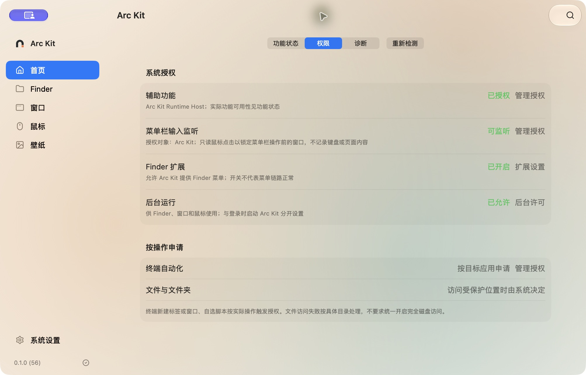
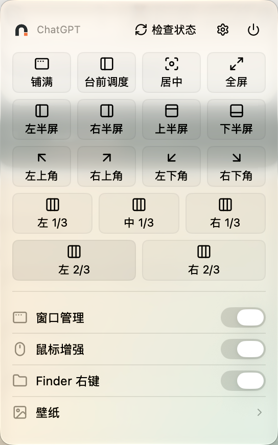
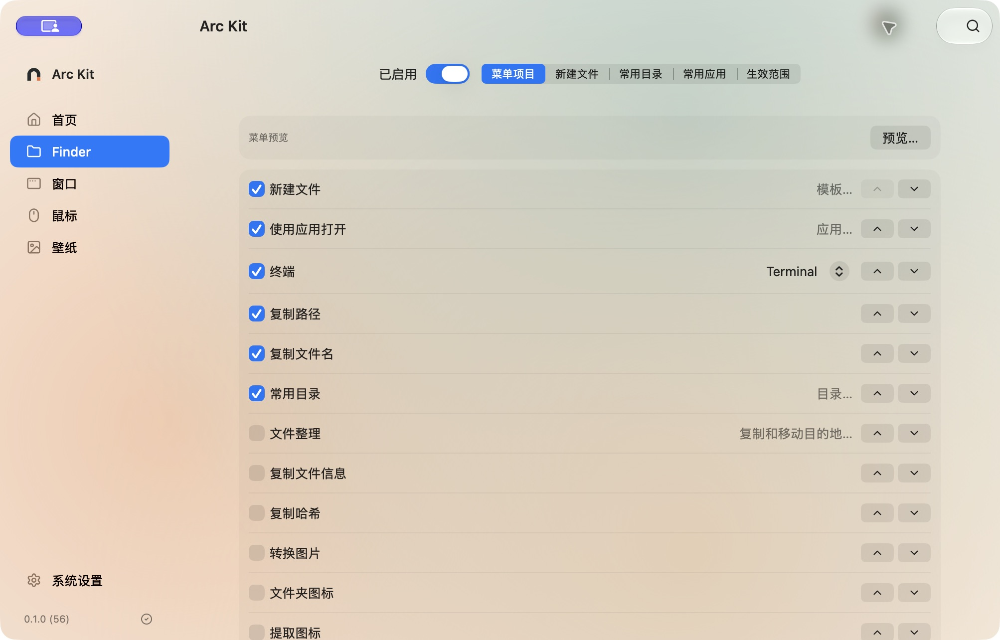
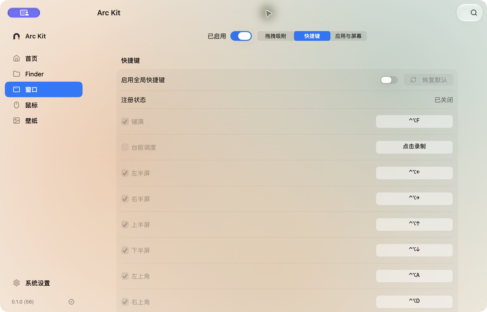
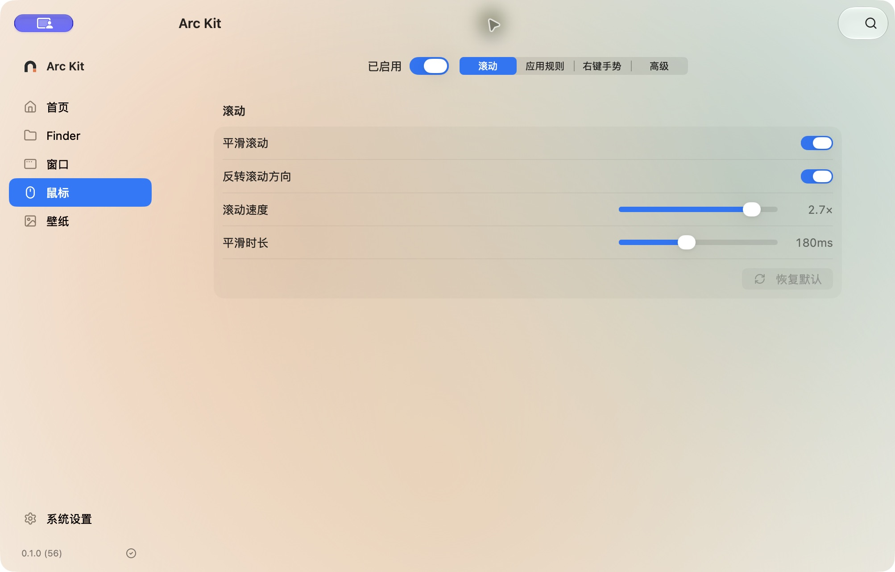
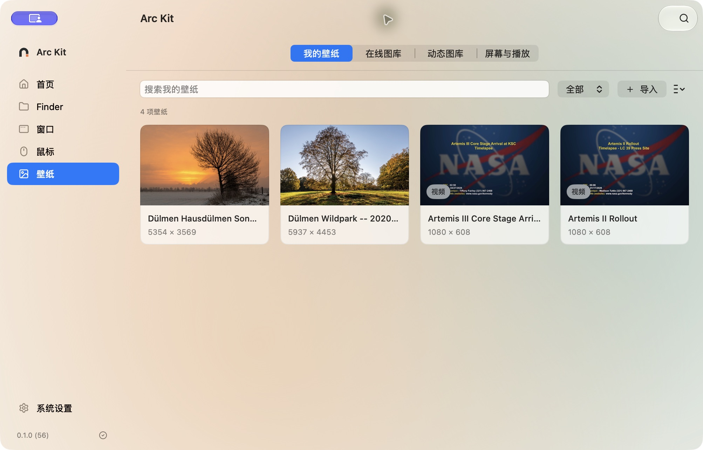

# Arc Kit

**Arc Kit，一个工具缝合怪，macOS 下的「要你命 3000」。**

[下载安装](https://arc-kit.com/download/) · [使用指南](https://arc-kit.com/guide/) · [官网](https://arc-kit.com) · [反馈问题](https://github.com/huixiangyang/arc-kit/issues)

Finder 增强、窗口管理、鼠标增强和壁纸，放在一个原生应用里。需要什么就开启什么。「要你命 3000」的名字借自《国产凌凌漆》。

支持 **macOS 13 及以上**，Apple Silicon 和 Intel 共用一个安装包。界面支持简体中文和 English。

## 安装

**直接下载安装包即可使用，不需要安装 Xcode，也不用编译源码。**

1. 打开[官网下载页](https://arc-kit.com/download/)，点击 **下载 ZIP**。安装包由本站提供，下载 ZIP 不需要访问 GitHub。
2. 双击下载的 `ArcKit-universal.zip` 解压，将 **Arc Kit.app** 拖进 Finder 左侧的 **应用程序（Applications）**。
3. 从“应用程序”中双击 Arc Kit，打开设置窗口。请保留在 `/Applications/Arc Kit.app`，不要直接从下载目录运行。

也可以从 [GitHub Releases](https://github.com/huixiangyang/arc-kit/releases) 下载 DMG，打开后将应用拖进“应用程序”。官网下载页会跟随正式版本更新。

### 第一次打开被 macOS 拦住了？

当前版本**没有 Apple Developer ID 签名和公证**。如果提示无法验证开发者或 Apple 无法检查 App，确认文件来自上面的官网下载页或官方 Release 后：

1. 先尝试打开一次 Arc Kit，再打开 **Mac 的系统设置 → 隐私与安全性**。
2. 向下找到 Arc Kit 被阻止的提示，点击 **仍要打开**。
3. 按系统提示认证，并在确认框中点击 **打开**。

这是 Apple 提供的单个 App 处理方式，见 [Apple 官方说明](https://support.apple.com/zh-cn/102445)。若提示文件已损坏，先删除下载文件并重新下载；仍无法打开时，反馈完整提示和 macOS 版本。若系统明确提示含有恶意软件或会损坏电脑，不要强行运行。

## 第一次使用

先选一个要用的功能，再到 **首页 → 权限** 按提示开启所需权限。Finder、窗口和鼠标的总开关都在各自页面顶部。

| 想做什么 | 先做这一步 |
| --- | --- |
| 使用 Finder 右键菜单 | 开启 Finder 总开关，并在“首页 → 权限”进入扩展设置，启用 Arc Kit 的 Finder 扩展 |
| 调整窗口、使用平滑滚动和手势 | 开启对应功能，按提示为 **Arc Kit Runtime Host** 授予辅助功能权限，并允许后台运行 |
| 从菜单栏调整当前窗口 | 按“首页 → 权限”的提示，为 **Arc Kit** 开启输入监控 |
| 换壁纸或应用背景 | 先在“壁纸”中导入图片或视频；访问文件时按系统提示选择允许 |

权限开启后回到 Arc Kit 点击“重新检测”。不用一次打开所有权限，具体入口见[安装与使用指南](https://arc-kit.com/guide/#permissions)。

## 界面与常用操作

本文五张设置页面截图来自 **0.1.0（56）发布版**；菜单栏截图由维护者提供。截图展示已有配置，不代表首次安装时所有开关都已开启。点击图片可查看大图。

### 菜单栏：点选布局、开关功能

点开菜单栏的 Arc Kit 图标，就能为当前窗口选择台前调度、半屏、三分屏等布局。窗口管理、鼠标增强和 Finder 右键可以分别开关，壁纸也有独立入口。

面板顶部显示当前应用，图中为 ChatGPT。

### Finder：在当前文件夹里新建文件

在 **Finder → 菜单项目** 勾选“新建文件”。回到 Finder，在文件夹空白处右键，选择模板即可创建文件。还可以启用打开终端、复制路径、常用目录、批量重命名、文件整理和图片转换。

### 窗口：台前调度、分屏和跨屏移动

先点击要调整的窗口，再点菜单栏的 Arc Kit 图标，选择 **台前调度**、铺满、居中等布局。台前调度布局将窗口放在右侧 85%，为左侧缩略图留出位置；不会替你打开 macOS 的台前调度开关。

想用键盘操作，在 **窗口 → 快捷键** 先打开“启用全局快捷键”，再启用或录制相应组合键；拖拽吸附和多屏规则也在“窗口”中设置。下图展示快捷键开关关闭时的界面。

### 鼠标：调整滚动手感

在 **鼠标 → 滚动** 调整平滑滚动、方向和速度，再切回常用应用试一下。某个应用不适合统一设置时，到“应用规则”单独调整；右键手势在同名标签页设置。

### 壁纸：导入图片，也能用视频

在 **壁纸 → 我的壁纸 → 导入** 选择图片或视频，打开素材详情，点击“设为桌面壁纸”，再选择目标显示器。多屏分别设置、轮换和视频播放位于“屏幕与播放”；也可以从在线图库和动态图库获取素材。

只想更换 Arc Kit 自己的背景，就选“设为应用背景”，或进入 **系统设置 → 背景** 使用柔光主题。应用背景与桌面壁纸分别设置。

截图中的照片：Dietmar Rabich / Wikimedia Commons / [CC BY-SA 4.0](https://creativecommons.org/licenses/by-sa/4.0/)；视频缩略图：NASA。原作品、截图来源和授权见[图片说明](Documentation/Images/README.md)。图库内容由使用者自行添加，不随安装包附送。

### 还有这些日常设置

- **系统设置 → 通用**：登录启动、菜单栏和 Dock 图标、语言与外观、Finder 隐藏文件、系统截图保存位置。
- **系统设置 → 数据管理**：备份与恢复、查看存储占用、清理缓存、导出诊断及卸载。
- **⌘K**：快速查找功能。设置会自动保存；关闭设置窗口后功能继续运行，选择“退出 Arc Kit”才会停止。

## 更新与常见问题

**怎么更新？** 在“系统设置 → 关于”点击“检查更新”，也可开启自动检查。应用内更新目前需要连接 GitHub；连接失败时，从[官网](https://arc-kit.com/download/)重新下载，退出旧版后替换“应用程序”里的 Arc Kit。替换应用不需要删除个人数据；更新前可在“数据管理”中导出备份。

**Finder 中没有菜单？** 检查 Finder 总开关和系统扩展开关，关闭旧右键菜单后重新打开。iCloud Drive 中的右键菜单不保证出现，可尝试 Finder 工具栏入口。详细排查见[使用说明](Documentation/使用.md)。

**快捷键或鼠标没反应？** 先看“首页 → 权限”和“功能状态”，再检查对应功能及快捷键开关。部分应用会限制窗口控制，滚动效果也会因应用、设备而不同。

**怎么卸载？** 从“系统设置 → 数据管理”使用卸载入口，可选择是否移除个人数据。需要保留配置时先导出备份。

遇到其他问题，请[提交 Issue](https://github.com/huixiangyang/arc-kit/issues)，附上 macOS 版本、Arc Kit 版本、操作步骤和提示截图。诊断报告可从“数据管理”导出，上传前检查其中内容。

## 参与开发

欢迎反馈问题、补充文档、翻译或提交代码。源码使用 Swift、SwiftUI、AppKit 与 SQLite；构建和运行细节单独放在开发文档中。

[贡献指南](CONTRIBUTING.md) · [开发与构建](Documentation/开发.md) · [架构](Documentation/架构.md) · [目录结构](Documentation/目录结构.md) · [交付与签名](Documentation/交付.md) · [版本记录](Documentation/版本说明.md) · [后续规划](Documentation/规划.md) · [安全问题](SECURITY.md)

项目源码采用 [MIT License](LICENSE)。第三方依赖和在线素材保留各自的授权，见[许可证说明](Licenses/README.md)。
